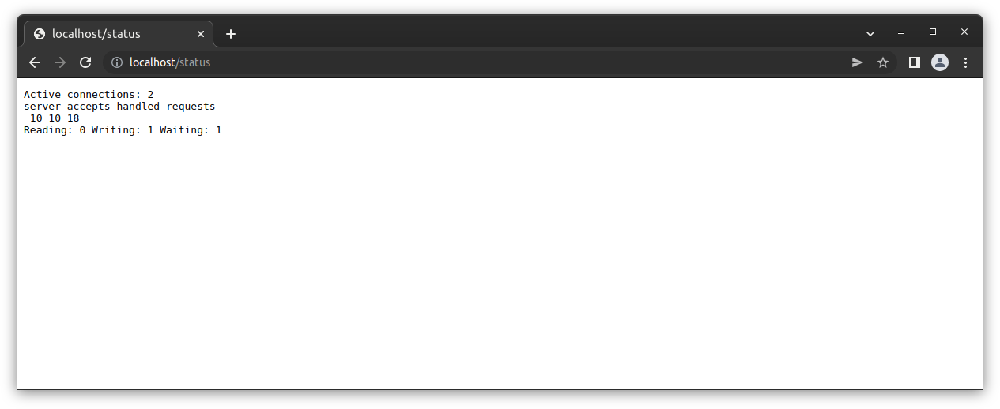

# Simple Docker

## Part 1. Готовый докер

В качестве конечной цели своей небольшой практики вы сразу выбрали написание докер образа для собственного веб сервера, а потому в начале вам нужно разобраться с уже готовым докер образом для сервера.
Ваш выбор пал на довольно простой **nginx**.

**== Задание ==**

##### Взять официальный докер образ с **nginx** и выкачать его при помощи `docker pull`

- Пыкачмваем с помощью sudo docker pull nginx
##### Проверить наличие докер образа через `docker images`

- Смотрим на существующие образы
##### Запустить докер образ через `docker run -d [image_id|repository]`

- Запускаем докер

##### Проверить, что образ запустился через `docker ps`

- Проверяем командой docker ps

##### Посмотреть информацию о контейнере через `docker inspect [container_id|container_name]`
##### По выводу команды определить и поместить в отчёт размер контейнера, список замапленных портов и ip контейнера

- Размер

- Порты

- IP
##### Остановить докер образ через `docker stop [container_id|container_name]`
##### Проверить, что образ остановился через `docker ps`

- Останавливаем докер

##### Запустить докер с замапленными портами 80 и 443 на локальную машину через команду *run*

- Запускаем докер с замапленными портами 80 и 443 

##### Проверить, что в браузере по адресу *localhost:80* доступна стартовая страница **nginx**

- Стартовая страница nginx доступна на 80 порту
##### Перезапустить докер контейнер через `docker restart [container_id|container_name]`
##### Проверить любым способом, что контейнер запустился

- Перезапускаем докер и проверяем командой ps
## Part 2. Операции с контейнером

Докер образ и контейнер готов ы. Теперь можно покопаться в конфигурации **nginx** и отобразить статус страницы.

**== Задание ==**

##### Прочитать конфигурационный файл *nginx.conf* внутри докер образа через команду *exec*

- читаем конфиг nginx 
##### Создать на локальной машине файл *nginx.conf*
##### Настроить в нем по пути */status* отдачу страницы статуса сервера **nginx**

- Настроили в нем по пути */status* отдачу страницы статуса сервера 

##### Скопировать созданный файл *nginx.conf* внутрь докер образа через команду `docker cp`

- Настроили в нем по пути */status* отдачу страницы статуса сервера 
##### Перезапустить **nginx** внутри докер образа через команду *exec*

- Перезагружаем nginx 
##### Проверить, что по адресу *localhost:80/status* отдается страничка со статусом сервера **nginx**

- Проверяем local/status 

##### Экспортировать контейнер в файл *container.tar* через команду *export*
##### Остановить контейнер

- экспортировали контейнер, и остановили контейнер
##### Удалить образ через `docker rmi [image_id|repository]`, не удаляя перед этим контейнеры

- Удаляем образ
##### Импортировать контейнер обратно через команду *import*

##### Запустить импортированный контейнер

- импортируем образ, и запучкаем контейнер

- Ура, все работает!
